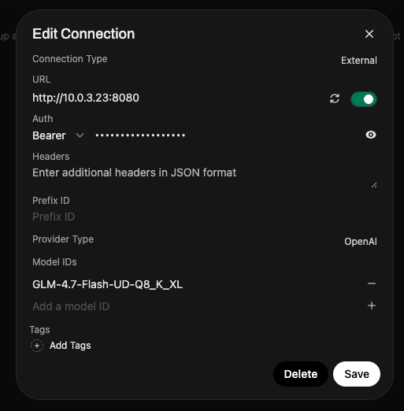

# GLM-4.7-Flash ROCm OpenAI Compatible Server

`llama.cpp` server running GLM-4.7-Flash model with Vulkan GPU acceleration.

> [!NOTE]
> Anecdotally, the experience using `opencode` with this setup on a Framework Mainboard (Ryzen AI Max 395+ 128gb) feels almost as fast as Claude Code. Definitely useable day-to-day! 

## 🏌️ Quick Start

```bash
docker-compose up -d
```

Server runs on `http://localhost:8080`

## 🧰 Requirements

- AMD GPU with ROCm support
- Docker with Vulkan device access

## 🛠️ Configuration

Download model at [Huggingface](https://huggingface.co/unsloth/GLM-4.7-Flash-GGUF/blob/main/GLM-4.7-Flash-UD-Q8_K_XL.gguf) and put it in the `models/` directory.

### Open Web-UI

In the "Admin Panel" under "Connections", add a new "OpenAI" style connection
like this:



> The API token can be anything

### opencode

In opencode, you can add the provider and model to your
`~/.config/opencode/opencode.jsonc` like this:

```jsonc
{
  "$schema": "https://opencode.ai/config.json",
  "provider": {
    "llama.cpp": {
      "npm": "@ai-sdk/openai-compatible",
      "name": "llm.puff.lan",
      "options": {
        "baseURL": "http://10.0.3.23:8080/v1",
        "includeUsage": true
      },
      "models": {
        "GLM-4.7-Flash-UD-Q8_K_XL": {
          "name": "GLM-4.7 Flash",
          "tool_call": true,
          "reasoning": true,
          "options": {
            "temperature": 0.2,
            "top_p": 0.95,
            "top_k": 40
          }
        }
      }
    }
  },
  "model": "GLM-4.7-Flash-UD-Q8_K_XL",
  "autoupdate": true,
}
```

## 📝 License

MIT
